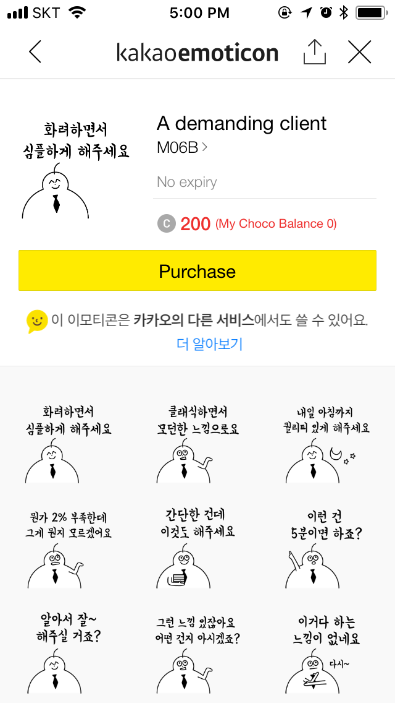
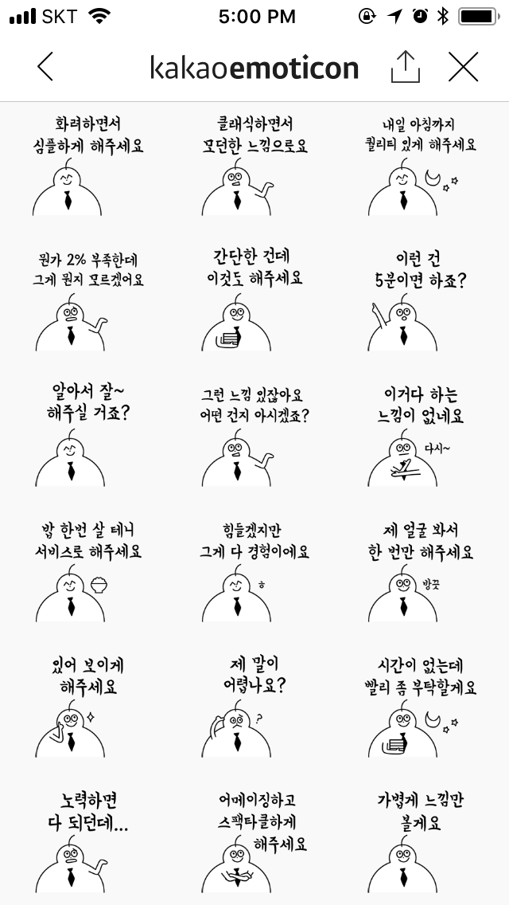
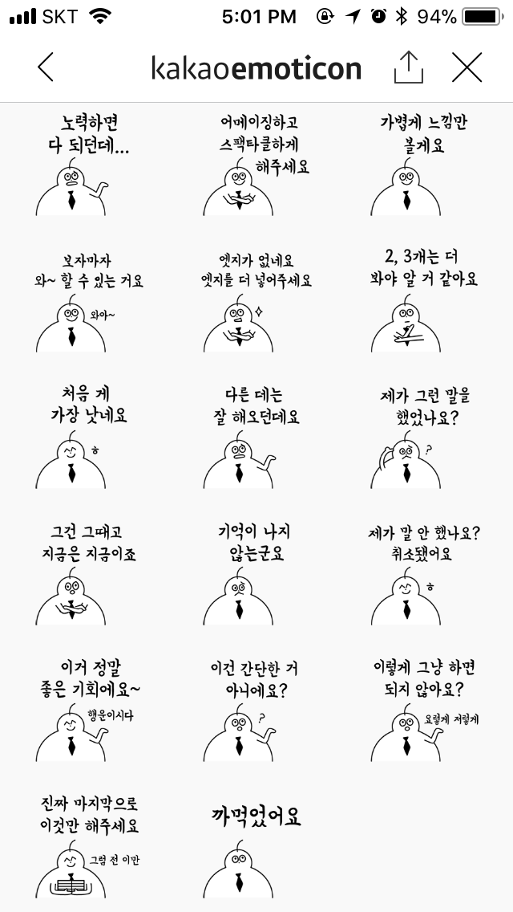
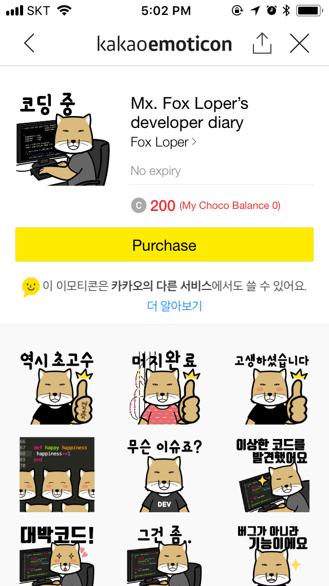
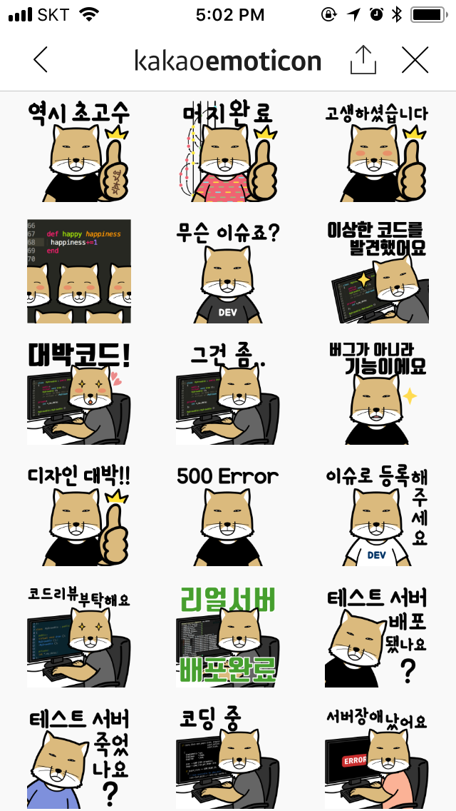
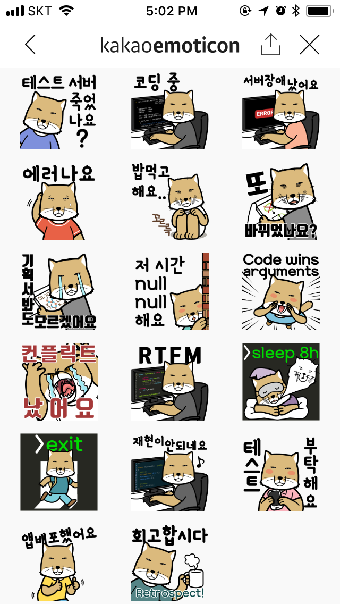

# 개발자와 일하기! 프로그래밍 첫걸음

---
<!--
page_number: true
$size: A4
footer : KB Card x Fastcampus, Wooyoung Choi, 2018
-->
## Introduce


### 최우영
- Co-founder, Developer at disceptio
- Solution Architect, Web Developer, Instructor
- python web crawling bootcamp(gilbut, 2018 expected)
- Skills: Python, Golang, Julia, Node.js, Google tag manager ...

#### blog: https://blog.ulgoon.com/
#### github: https://github.com/ulgoon/
#### email: me@ulgoon.com

---
## Notice
- 수업의 난이도는 문과생도 이해할 수 있을 정도로 쉽게 진행할 예정입니다.
- 50분 수업, 10분 휴식
- 점심시간: 12시 ~ 1시 
- https://github.com/ulgoon/html-for-everyone 에서 슬라이드와 수업에 필요한 자료를 다운로드 받을 수 있습니다.
- https://www.sublimetext.com/ 에서 sublime text로 실습을 진행합니다.
- 브라우저는 Google Chrome!

---
## Index
- 프로그래밍 Warm-up
	- 컴퓨터와 프로그래밍
	- Computational Thinking
	- 웹 이해하기
- 프로그래밍 맛보기
	- HTML/CSS
	- javaScript
- 마무리

---
## 프로그래밍 Warm-up

---
### 우리는 왜 이 강의를 듣는가?

---




---




---
### IT Jobs Explained With A Broken Lightbulb
https://blog.toggl.com/lightbulb-cartoon-developers/

---
### 프로그래밍을 위한 사전 지식

---
### Computer

- Compute + er: 연산을 수행하는 기계,장치 또는 사람

---
### Computer vs Calculator
<div align="center">


</div>

- `Stored Program` computer -> Computer
	- Stores and Executes intructions
- `Fixed Program` computer -> Calculator
	- just calculate 

---
## Basic Computer Architecture


---
### Computational Thinking
> 정답이 정해지지 않은 문제에 대한 해답을 일반화하는 과정

컴퓨터와 개발자의 동작 및 사고체계를 이해하는데 매우 도움이 됩니다!

---
<iframe width="960" height="540" src="https://www.youtube.com/embed/GrsqZSDMKO4" frameborder="0" allow="autoplay; encrypted-media" allowfullscreen></iframe>

---
### Process of Computational Thinking
1) 문제 조직화(추상화) - Problem Formulation (abstraction)
2) 솔루션 구현(자동화) - Solution Expression (automation)
3) 솔루션 실행 및 평가(분석) - Solution Execution & Evaluation (analyses)

---
### Computational Thinking by example
- 문제인지: **배가고프다!**
- 문제조직화
	- 문제분해
		- 얼마나 배가고픈가
			- 간단히 떼운다
			- 정식을 먹는다
		- 나는 지금 어디인가?
			- 집: 밥솥의 밥 또는 라면을 먹는다
			- 여의도
				- 편의점: 삼각김밥 ~ 도시락
				- 식당: 패스트푸드 ~ 점심뷔페

---
### Computational Thinking by example
- 패턴인지
	- <span style="font-size:24px;">`아! 배가 어느정도 고프면 어디서 뭔가를 먹음으로써 Hunger가 False가 되는구나` </span>
- 일반화/추상화
	- 추상화(간결하고 명확하게 단순화, 일반화, 개념화)
		- <span style="font-size:24px;">`배가 고프면` `{{얼마나}}`배가 고플때, `{{어디}}`에서 `{{어떻게}}`해결함</span>
	- 알고리즘

---
### Computational Thinking by practice


---
## 웹 이해하기

---
### Data?
- 컴퓨터가 처리할 수 있는 문자, 숫자, 소리, 그림 따위의 형태로 된 정보.
- Latin "Datum"의 복수형 "Data"에서 유래

---
### Internet
- Internet(`International Network`): TCP/IP를 활용하여 정보를 주고 받는 통신 네트워크(www)

---
### WWW(World Wide Web)
- URL로 구분될 수 있는 문서와 리소스들이 하이퍼링크를 통해 연결되는 정보공간
- 1989년, Tim Berners-Lee가 CERN의 내부 문서 공유 시스템을 개발


---
## 웹 개발 알아보기


---
### Frontend? Backend?


---
### Frontend


---
### Backend


---
### Web architecture


---
### 웹, 앱 개발에 쓰이는 언어와 도구들

---
### Frontend(Web)
- HTML/CSS
- javaScript(Web Assembly)
- jQuery
- AJAX
- Frontend Frameworks
	- Angular
	- React.js
	- vue.js
- gulp, webpack, babel, .. 

---
### Frontend(App)
- swift, objC(iOS)
- kotlin, java(Android)
- Lots of Tools..(ex.retrofit, rxjava, cocoa touch)

---
### Backend
- Depend on Language..
```javaScript
{
    java:spring,
    python:[django, flask],
    c,c++: asp.net,
    ruby: ruby on rails,
    php: Laravel,
    javaScript: node.js,
    Golang: itself,
}
```
- Database
- Cloud(AWS, google cloud, MS Azure)

---
### Tools for Developer
- git
- travisCI, jenkins
- slack, trello

---
## HTML/CSS
Requirement: https://www.sublimetext.com/

---
### HTML
- HyperText Markup Language
- 웹사이트의 구조를 정의하기 위해 탄생
- HTML 5.2가 웹 표준

---
### 웹은 표준과 접근성이 매우 중요합니다!
- 위를 준수하지 않으면 검색 점수에서 불리해집니다.
- 접근성을 높여야 보다 다양한 사용자가 상품구매까지 도달할 수 있습니다.
- 현재 웹 표준은 5.2!!

---
### Get Started!
```html
<!doctype html>
<html>
 <head></head>
 <body></body>
</html>
```

---
### Get Started!
```html
<!doctype html>
<html>
 <head>
  <meta charset="utf-8">
  <meta name="viewport" content="width=device-width, 
  initial-scale=1.0">
  <title>My first HTML</title>
 </head>
 <body></body>
</html>
```

---
### Get Started!
```html
<!doctype html>
<html>
 <head>
  <meta charset="utf-8">
  <meta name="viewport" content="width=device-width, 
  initial-scale=1.0">
  <title>My first HTML</title>
 </head>
 <body>
  <h1>Home</h1>
  <p>This is home.</p>
 </body>
</html>
```

---
### add Hyperlink
```html
<body>
 <h1>Home</h1>
 <p>This is home.</p>
 <a href="https://www.kbcard.com/">KB 국민카드 바로가기</a>
</body>
```

---
### add Image
```html
<body>
 <h1>Home</h1>
 <p>This is home.</p>
 <a href="https://www.kbcard.com/">KB 국민카드 바로가기</a>

 
</body>
```

---
### table for data!
```html
<body>
<!-- beneath img -->
<table>
 <thead>
 </thead>
 <tbody>
 </tbody>
</table>

</body>
```

---
### table for data! - thead
```html
 <thead>
  <tr>
   <th>구분</th>
   <th>서비스영역</th>
   <th>적립률</th>
  </tr>
 </thead>
```

---
### table for data! - tbody
```html
 <tbody>
  <tr>
   <td>주유서비스</td>
   <td>주유</td>
   <td>500/l 적립</td>
  </tr>
 </tbody>
```

---
### div, span
- div는 요소들을 묶어 표현할 때 사용합니다.
```html
<div>
<h1></h1>
<p></p>
</div>

```

- span은 텍스트의 일부에 스타일을 지정할 때 사용합니다.
```html
<p>
<span style="font-weight:bolder;">
KB 국민카드 
</span>
페이지에 오신것을 환영합니다.</p>
```


---
### CSS

---
## CSS
- Cascading Style Sheet
- 웹 문서(HTML)의 스타일을 간단하게... 꾸밀 수 있도록 도와주는 스타일 문서
- 현재 CSS3 릴리즈

---
## CSS를 적용하는 법

---
### 1. Internal Stylesheet
```html
<head>
 <style>
 body {background-color:#bbbbbb;}
 </style>
</head>
```

---
### 2. In-line Stylesheet
`<span style='color:gray;'></span>`

---
### 3. style.css(External Stylesheet)
- index.html이 있는 디렉토리에 static 디렉토리를 생성하세요
- static 디렉토리에 style.css파일을 만드세요
- index.html의 head에 style.css를 적용하면 끝!
`<link rel="stylesheet" type="text/css" href="static/style.css">`

---
## 왜 style.css를 써야할까요??
without CSS
```html
<p style='color:#ff0000;'>blah blah 1</p>
<p style='color:#00ff00;'>blah blah 2</p>
<p style='color:#0000ff;'>blah blah 3</p>
```

with CSS
```html
<p class='font-red'>blah blah 1</p>
<p class='font-green'>blah blah 2</p>
<p class='font-blue'>blah blah 3</p>

```
```css
.font-red {color:#ff0000;}
.font-green {color:#00ff00;}
.font-blue {color:#0000ff;}
```

---
## id, class, just tags
```css
#some-id {color:#ff0000;}

.some-class {color:#00ff00;}

body {background-color:#dddddd;}
```

---
### Font size
em 대문자 M의 너비를 기준으로 크기 조절
px 모니터 픽셀에 따라 크기 변함
pt 포인트. 문서에서 많이 사용함
`font-size: em | px | pt;`

---
### Font Weight
글자 굵기 지정

`font-weight: normal | bold | bolder | lighter | 100 ~ 900`

---
### color
`color: <색상>`
```
rgb(0,255,0)
green
#00ff00
#0f0
```

---
## CSS Box

---
### Content Box width, height
`width: px | em | % | auto`

`height: px | em | % | auto`

---
### Content align
```css
{
	width: 30%;
	margin-left: auto;
	margin-right: auto;
    
    or
    
	margin: 0 auto;
}
```

```css
{
	height: 10em;
	line-height: 10em;
    
    or
    
	vertical-align: middle;
}
```

---
### Margin
외부 여백 영역
```html
<body>
<div class="box1"></div>
<div class="box2"></div>
<div class="box3"></div>
<div class="box4"></div>
</body>
```

---
### Margin
```html
div {
 width: 800px;
 height: 450px;
 background: #0099ee;
}
.box1 {margin:20px 30px 40px 50px;}
.box2 {margin:20px;}
.box3 {margin:20px 30px;}
.box4 {margin:20px 30px 50px;}
```

---
### padding
내부 여백 영역

```css
.padding-box {
 width: 400px;
 height: auto;
 background: #0099ee;
 display: inline-block;
 margin: 10px;
 color: #ffffff;
}

.padding-box1 {padding: 1px;}
.padding-box2 {padding: 1px 10px;}
.padding-box3 {padding: 1px 20px 30px 40px;}
```
```html
<div class="padding-box padding-box1">Sed.</div>
<div class="padding-box padding-box2">
Sed posuere consectetur est at lobortis. </div>
<div class="padding-box padding-box3">
Sed posuere consectetur est at lobortis. </div>
```


---
## javaScript

---
### javaScript란?
- 객체 기반의 스크립트 프로그래밍 언어
- 웹페이지의 동적인 제어 목적
- Netscape의 Brendan Eich가 모카(Mocha)를 개발
- LiveScript -> javaScript로 개명


---
### Static Web site - 1
<div id="dynamic-btn1" style="width:200px; height:200px; background:red;"></div>

---
### Static Web site - 2
<div id="dynamic-btn2" style="width:200px; height:200px; background:green;"></div>

---
### Static Web site - 3
<div id="dynamic-btn3" style="width:200px; height:200px; background:blue;"></div>


---
### Dynamic Web site
<div id="dynamic-btn" style="width:200px; height:200px; background:black;"></div>
<button type="button" onclick="document.getElementById('dynamic-btn').style.background='red'" style="font-size:20px;">Red</button>
<button type="button" onclick="document.getElementById('dynamic-btn').style.background='green'" style="font-size:20px;">Green</button>
<button type="button" onclick="document.getElementById('dynamic-btn').style.background='blue'" style="font-size:20px;">Blue</button>


---
### Java != javaScript

|Java|vs|javaScript|
|:--:|:--:|:--:|
|Sun|개발|Brendan Eich|
|JVM|구동방식|Script Engine(Browser)|
|C|영향|C|
|인도|Like|인도네시아|

---
### Try "hello world!"

```javaScript
console.log("hello javaScript!");
alert("hello javaScript!");
document.write("hello javaScript!");
```

---
### variable, statements, operation

```javaScript
// declare a,b,c
var a,b,c;
// assign a,b
a = 3;
b = 5;
// assign statements with + operator
c = a + b;
```

---
### functions

```javaScript
function name(parameter1, parameter2, ..) {
    // code to be executed
}
```

---
### functions

```javaScript
function printHello(name) {
    console.log("hello, " + name);
}
```

---
### functions

```javaScript
function aweSum(num1, num2) {
    return num1 + num2;
}
```

---
## Conditional statements - if, else

```javaScript
var a = 10;
if (a===10){
    console.log("a is 10");
} else {
    console.log("a is not 10");
}
```

---
## Conditional statements - if in else

```javaScript
var a = 10;
if (a===10){
    console.log("a is 10");
} else if (a===5){
    console.log("a is 5");
} else {
    console.log("a is neither 10 nor 5");
}
```

---
### =? ==? ===??

- `=`: Assignment Operator(`a=10`)
- `==`: Equal Operator(`1=="1"`)
- `===`: Strict Equal Operator(`1==="1"`)


---
### loop - for

```javaScript
for (i = 1; i < 11; i++) { 
    console.log("hello for "+i+" times");
}
```

---
### loop - while

```javaScript
while (i<11){
    console.log("hello");
    i++;
}
```

---
## Countdown with javaScript
<p id="demo"></p>

<script>
var countDownDate = new Date("Mar 24, 2018 15:37:25")
.getTime();

var x = setInterval(function() {
  var now = new Date().getTime();

  var distance = countDownDate - now;

  var days = Math.floor(distance / (1000 * 60 * 60 * 24));
  var hours = Math.floor((distance % (1000 * 60 * 60 * 24)) 
  / (1000 * 60 * 60));
  var minutes = Math.floor((distance % (1000 * 60 * 60)) 
  / (1000 * 60));
  var seconds = Math.floor((distance % (1000 * 60)) / 1000);

  document.getElementById("demo").innerHTML = 
  days + "일 " 
  + hours + "시간 "
  + minutes + "분 " 
  + + seconds + "초 ";


if (distance < 0) {
    clearInterval(x);
    document.getElementById("demo").innerHTML = "EXPIRED";
  }
}, 1000);
</script>


---
### add countdown feature

```javascript
<p id="demo"></p>

<script>
var countDownDate = new Date("Mar 24, 2018 15:37:25")
.getTime();

var x = setInterval(function() {
}, 1000);
</script>
```

---
### add countdown feature

```javascript
  var now = new Date().getTime();

  var distance = countDownDate - now;

  var days = Math.floor(distance / (1000 * 60 * 60 * 24));
  var hours = Math.floor((distance % (1000 * 60 * 60 * 24)) 
  / (1000 * 60 * 60));
  var minutes = Math.floor((distance % (1000 * 60 * 60)) 
  / (1000 * 60));
  var seconds = Math.floor((distance % (1000 * 60)) / 1000);

  document.getElementById("demo").innerHTML = 
  days + "일 " 
  + hours + "시간 "
  + minutes + "분 " 
  + + seconds + "초 ";


if (distance < 0) {
    clearInterval(x);
    document.getElementById("demo").innerHTML = "EXPIRED";
  }
```

---
## 사용자 입력정보 표출
```html
<script>
  document.getElementById('submit').onclick = function(){
    var inputName = document.getElementById('name').value
    var inputEmail = document.getElementById('email').value
    alert('신청해주셔서 감사합니다 ' + inputName + ' 님. \n 제출해주신 ' + inputEmail + '로 곧 연락드리겠습니다.')
  }
</script>
```

---
## How to work with Developers


---
### Backend 엔지니어가 신경쓰는 것 
- 데이터 모델
- 성능
- 아키텍쳐의 효율
- API의 일관성

---
### Frontend 엔지니어가 신경쓰는 것
- 웹 표준과 접근성
- UI/UX
- 크로스 브라우징 지원
- 멀티 디바이스 대응

---
### 개발자가 기획회의에서 부정적인 이유
- 단순한 아이디어지만, 복잡한 시스템
- 개발자가 떠안게 될 부채들
- 무리한 일정


---
### 개발자는 보통 이렇길 바랍니다.
- 기획서가 명확하길 바랍니다.
- 기획서의 버전이 존재하길 바랍니다.
- 요구사항의 잦은 변경이 일어나지 않기를 바랍니다.
- 간단한 기능이라 할지라도 현재 존재하는 프로덕트에는 꽤 복잡한 기능일 수 있다는 걸 알아주길 원합니다.
- 유지보수가 용이하길 원합니다.
- 우쭈쭈 해주길 원합니다.

---
## Thank you!
